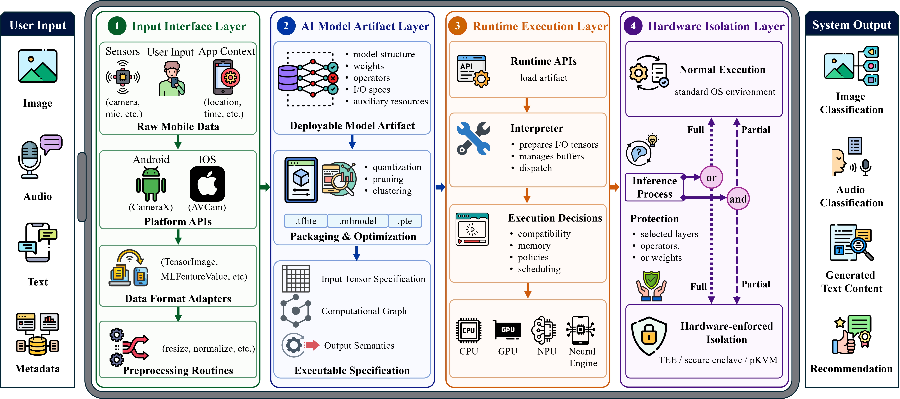
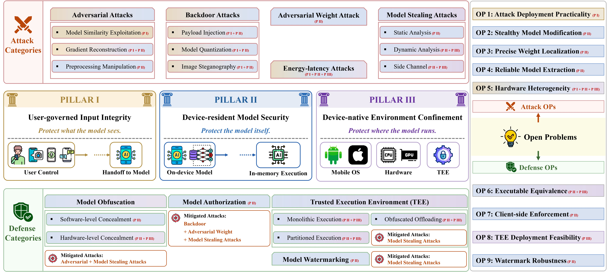

# Awesome Mobile On-Device AI Security

[](https://awesome.re)
[](LICENSE)
[](https://github.com/Jinxhy/Awesome-MoAI-Security/stargazers)

> A curated, taxonomy-driven reading list for **Mobile On-Device AI (MoAI) Security**: attacks, defenses, and open problems for AI models deployed directly inside mobile apps on end-user devices.

This repository is maintained as the companion resource for:

> **SoK: Attack and Defense Landscape of Mobile On-device AI Systems**  
> Yujin Huang, Xin Zheng, Xingliang Yuan, Kwok-Yan Lam.  
> Paper: coming soon.

Mobile on-device AI systems execute AI models locally through ML frameworks such as **LiteRT/TFLite**, **Core ML**, **ExecuTorch**, **ONNX**, and hardware-backed accelerators. This repo tracks the security research needed to understand and protect such systems, as the local storage of on-device models introduces new security risks.

## Overview of a Mobile On-Device AI system
<p align="center">
  
</p>

## Contents

- [Reading roadmap](#reading-roadmap)
- [Taxonomy at a glance](#taxonomy-at-a-glance)
- [Attacks on MOAI systems](#attacks-on-moai-systems)
  - [Adversarial attacks](#adversarial-attacks)
  - [Backdoor attacks](#backdoor-attacks)
  - [Adversarial weight and model-tampering attacks](#adversarial-weight-and-model-tampering-attacks)
  - [Model stealing and extraction attacks](#model-stealing-and-extraction-attacks)
  - [Side-channel and runtime attacks](#side-channel-and-runtime-attacks)
  - [Energy-latency and availability attacks](#energy-latency-and-availability-attacks)
- [Defenses for MOAI systems](#defenses-for-moai-systems)
  - [Model obfuscation and concealment](#model-obfuscation-and-concealment)
  - [Model authorization and app-model binding](#model-authorization-and-app-model-binding)
  - [Trusted execution environments and secure inference](#trusted-execution-environments-and-secure-inference)
  - [Model watermarking and post-deployment accountability](#model-watermarking-and-post-deployment-accountability)
- [Open problems](#open-problems)
- [Citation](#citation)

## Reading roadmap

New to MoAI security? Start here:

1. **Understand the ecosystem.** Read empirical studies on deep learning apps and on-device models in Android/iOS apps.
2. **Learn the core risk.** Study model extraction and model protection papers, because local model residency is the central security shift in MoAI systems.
3. **Understand the attack surfaces.** Study how MoAI attacks arise across input interfaces, model artifacts, runtime execution, and hardware-backed environments.
4. **Connect defenses to the surfaces.** Examine how MoAI defenses protect these surfaces across pre-deployment, runtime execution, and post-deployment phases.
5. **Look forward.** Explore new security challenges in on-device training, on-device GenAI, and agentic MoAI systems.


<br>
• &nbsp;[A First Look at Deep Learning Apps on Smartphones](https://arxiv.org/pdf/1812.05448)  
• &nbsp;[A First Look at On-device Models in iOS Apps](https://arxiv.org/pdf/2307.12328)

<br>
• &nbsp;[Mind Your Weight(s): A Large-scale Study on Insufficient ML Model Protection in Mobile Apps](https://www.usenix.org/conference/usenixsecurity21/presentation/sun-zhichuang)

<br>
• &nbsp;[Robustness of On-device Models: Adversarial Attack to Deep Learning Models on Android Apps](https://arxiv.org/pdf/2101.04401)  
• &nbsp;[DeepPayload: Black-box Backdoor Attack on Deep Learning Models through Neural Payload Injection](https://dl.acm.org/doi/10.1109/ICSE43902.2021.00035)  
• &nbsp;[Typhon Unleashed: Practical Adversarial Weight Attacks Against On-Device Deep Learning Models](https://ieeexplore.ieee.org/document/11407485)  
• &nbsp;[Energy-Latency Attacks to On-Device Neural Networks via Sponge Poisoning](https://arxiv.org/pdf/2305.03888)

<br>
• &nbsp;[ModelObfuscator: Obfuscating Model Information to Protect Deployed ML-based Systems](https://arxiv.org/pdf/2306.06112)  
• &nbsp;[ShadowNet: A Secure and Efficient On-device Model Inference System](https://arxiv.org/abs/2011.05905)  
• &nbsp;[THEMIS: Towards Practical IP Protection for Post-Deployment On-Device DL Models](https://www.usenix.org/conference/usenixsecurity25/presentation/huang-yujin)


## Taxonomy at a glance

| MoAI security pillar | What it protects | Representative attacks | Representative defenses |
|---|---|---|---|
| **User-governed input integrity** | The end-to-end integrity of user inputs, from mobile data acquisition to model-input handoff | Adversarial Attacks, Backdoor Attacks, Energy-latency Attacks | - |
| **Device-resident model security** | Deployed model artifacts and all post-deployment forms in which models are stored, loaded, transformed, or materialized on devices | Adversarial Attacks, Backdoor Attacks, Adversarial Weight Attacks, Model Stealing Attacks,  Energy-latency Attacks | Model Obfuscation, Model Authorization, TEE, Model Watermarking |
| **Device-native environment confinement** | Sensitive inference computation and runtime states across the mobile OS, AI runtime, memory subsystem, and hardware-backed execution environments | Model Stealing Attacks, Energy-latency Attacks | Model Obfuscation, TEE |

## Cross-pillar Security Analysis
<p align="center">
  
</p>

## Attacks on MoAI systems


#### Model Similarity Exploitation

- [**Robustness of On-device Models: Adversarial Attack to Deep Learning Models on Android Apps**](https://dl.acm.org/doi/10.1109/ICSE-SEIP52600.2021.00019) [[Code](https://github.com/Jinxhy/AppAIsecurity)]  
  <sub>IEEE/ACM International Conference on Software Engineering: Software Engineering in Practice (ICSE-SEIP 2021)</sub>

- [**Smart App Attack: Hacking Deep Learning Models in Android Apps**](https://dl.acm.org/doi/10.1109/TIFS.2022.3172213) [[Code](https://github.com/Jinxhy/SmartAppAttack)]  
  <sub>IEEE Transactions on Information Forensics and Security (TIFS 2022)</sub>

- [**Understanding Real-world Threats to Deep Learning Models in Android Apps**](https://dl.acm.org/doi/10.1145/3548606.3559388) [[Code](https://github.com/Advdroid/advdroid-pro)]    
  <sub>ACM SIGSAC Conference on Computer and Communications Security (CCS 2022)</sub>

- [**Cheating Your Apps: Black-box Adversarial Attacks on Deep Learning Apps**](https://onlinelibrary.wiley.com/doi/10.1002/smr.2528)  
  <sub>Journal of Software: Evolution and Process (JSEP 2024)</sub>

- [**A First Look at On-device Models in iOS Apps**](https://dl.acm.org/doi/10.1145/3617177) [[Code](https://github.com/huhanGitHub/iOS-App-database)]  
  <sub>ACM Transactions on Software Engineering and Methodology (TOSEM 2024)</sub>

#### Gradient Reconstruction

- [**Investigating White-Box Attacks for On-Device Models**](https://arxiv.org/abs/2402.05493) [[Code](https://github.com/zhoumingyi/REOM)]  
  <sub>IEEE/ACM International Conference on Software Engineering (ICSE 2024)</sub>

- [**TIM: Enabling Large-Scale White-Box Testing on In-App Deep Learning Models**](https://doi.org/10.1109/TIFS.2024.3455761) [[Code](https://zenodo.org/record/7548141)]  
  <sub>IEEE Transactions on Information Forensics and Security (TIFS 2024)</sub>

#### Preprocessing Manipulation

- [**Beyond the Model: Data Pre-processing Attack to Deep Learning Models in Android Apps**](https://dl.acm.org/doi/10.1145/3591197.3591308) [[Code](https://github.com/Alexender-Ye/attack-focused-on-pre-processing)]  
  <sub>Secure and Trustworthy Deep Learning Systems Workshop (SecTL 2023)</sub>


#### Payload Injection

- [**DeepPayload: Black-box Backdoor Attack on Deep Learning Models through Neural Payload Injection**](https://dl.acm.org/doi/10.1109/ICSE43902.2021.00035) [[Code](https://github.com/yuanchun-li/DeepPayload)]  
  <sub>IEEE/ACM International Conference on Software Engineering (ICSE 2021)</sub>

- [**MalModel: Hiding Malicious Payload in Mobile Deep Learning Models with Black-box Backdoor Attack**](https://link.springer.com/article/10.1007/s10515-025-00569-7) [[Code](https://github.com/hjygh/MalModel)]  
  <sub>Automated Software Engineering (ASEJ 2026)</sub>

#### Model Quantization

- [**Quantization Backdoors to Deep Learning Commercial Frameworks**](https://arxiv.org/abs/2108.09187) [[Code](https://github.com/quantization-backdoor/quantization-backdoor)]  
  <sub>IEEE Transactions on Dependable and Secure Computing (TDSC 2024)</sub>

#### Image Steganography

- [**Stealthy Backdoor Attack to Real-world Models in Android Apps**](https://arxiv.org/abs/2501.01263)  
  <sub>arXiv preprint (arXiv 2025)</sub>


- [**Typhon Unleashed: Practical Adversarial Weight Attacks Against On-Device Deep Learning Models**](https://ieeexplore.ieee.org/document/11407485)  
  <sub>IEEE Transactions on Dependable and Secure Computing (TDSC 2026)</sub>


#### Static Analysis

- [**A First Look at Deep Learning Apps on Smartphones**](https://arxiv.org/pdf/1812.05448) [[Code](https://github.com/xumengwei/MobileDL)]<br>
  <sub>The World Wide Web Conference (WWW 2019)</sub>

- [**A First Look at On-device Models in iOS Apps**](https://arxiv.org/pdf/2307.12328) [[Code](https://github.com/huhanGitHub/iOS-App-database)]<br>
  <sub>ACM Transactions on Software Engineering and Methodology (TOSEM 2023)</sub>

- [**Mind Your Weight(s): A Large-scale Study on Insufficient Machine Learning Model Protection in Mobile Apps**](https://www.usenix.org/conference/usenixsecurity21/presentation/sun-zhichuang) [[Code](https://github.com/RiS3-Lab/ModelXRay)]<br>
  <sub>USENIX Security Symposium (USENIX Security 2021)</sub>

- [**REDLC: Learning-Driven Reverse Engineering for Deep Learning Compilers**](https://doi.org/10.1109/ISSRE62328.2024.00029)<br>
  <sub>IEEE International Symposium on Software Reliability Engineering (ISSRE 2024)</sub>

#### Dynamic Analysis

- [**Mind Your Weight(s): A Large-scale Study on Insufficient Machine Learning Model Protection in Mobile Apps**](https://www.usenix.org/conference/usenixsecurity21/presentation/sun-zhichuang) [[Code](https://github.com/RiS3-Lab/ModelXRay)]<br>
  <sub>USENIX Security Symposium (USENIX Security 2021)</sub>

- [**Understanding Real-world Threats to Deep Learning Models in Android Apps**](https://dl.acm.org/doi/10.1145/3548606.3559388) [[Code](https://github.com/Advdroid/advdroid-pro)]<br>
  <sub>ACM SIGSAC Conference on Computer and Communications Security (CCS 2022)</sub>

- [**DeMistify: Identifying On-device Machine Learning Models Stealing and Reuse Vulnerabilities in Mobile Apps**](https://dl.acm.org/doi/10.1145/3597503.3623325) [[Code](https://github.com/MGYN/DeMistify)]<br>
  <sub>IEEE/ACM International Conference on Software Engineering (ICSE 2024)</sub>

- [**Game of Arrows: On the (In-)Security of Weight Obfuscation for On-Device TEE-Shielded LLM Partition Algorithms**](https://www.usenix.org/conference/usenixsecurity25/presentation/wang-pengli) [[Code](https://github.com/qsxltss/Game-of-Arrows)]<br>
  <sub>USENIX Security Symposium (USENIX Security 2025)</sub>

#### Side Channel

- [**Model Extraction Attack against On-Device Deep Learning with Power Side Channel**](https://doi.org/10.1109/ISQED60706.2024.10528716)  
  <sub>IEEE International Symposium on Quality Electronic Design (ISQED 2024)</sub>

- [**DeepCache: Revisiting Cache Side-Channel Attacks in Deep Neural Networks Executables**](https://dl.acm.org/doi/10.1145/3658644.3690239)  
  <sub>ACM SIGSAC Conference on Computer and Communications Security (CCS 2024)</sub>


- [**Energy-Latency Attacks to On-Device Neural Networks via Sponge Poisoning**](https://dl.acm.org/doi/10.1145/3591197.3591307)  
  <sub>Secure and Trustworthy Deep Learning Systems Workshop (SecTL 2023)</sub>

## Defenses for MoAI systems


#### Software-level Concealment

- [**ModelObfuscator: Obfuscating Model Information to Protect Deployed ML-Based Systems**](https://dl.acm.org/doi/10.1145/3597926.3598113) [[Code](https://github.com/zhoumingyi/ModelObfuscator)]<br>
  <sub>ACM SIGSOFT International Symposium on Software Testing and Analysis (ISSTA 2023)</sub>

- [**DynaMO: Protecting Mobile DL Models through Coupling Obfuscated DL Operators**](https://dl.acm.org/doi/10.1145/3691620.3694998) [[Code](https://github.com/zhoumingyi/DynaMO)]<br>
  <sub>IEEE/ACM International Conference on Automated Software Engineering (ASE 2024)</sub>

- [**Model-less Is the Best Model: Generating Pure Code Implementations to Replace On-Device DL Models**](https://dl.acm.org/doi/10.1145/3650212.3652119) [[Code](https://github.com/zhoumingyi/CustomDLCoder)]<br>
  <sub>ACM SIGSOFT International Symposium on Software Testing and Analysis (ISSTA 2024)</sub>

#### Hardware-level Concealment

- [**NNSplitter: An Active Defense Solution for DNN Model via Automated Weight Obfuscation**](https://proceedings.mlr.press/v202/zhou23h.html) [[Code](https://github.com/Tongzhou0101/NNSplitter)]<br>
  <sub>International Conference on Machine Learning (ICML 2023)</sub>

- [**A Novel Obfuscation Method Based on Majority Logic for Preventing Unauthorized Access to Binary Deep Neural Networks**](https://www.nature.com/articles/s41598-025-09722-4)<br>
  <sub>Scientific Reports (Sci. Rep. 2025)</sub>


- [**MMGuard: Automatically Protecting On-Device Deep Learning Models in Android Apps**](https://ieeexplore.ieee.org/document/9474328) [[Code](https://github.com/MMGuard123/MMGuard)]<br>
  <sub>IEEE Security and Privacy Workshops (SPW 2021)</sub>


- [**Offline Model Guard: Secure and Private ML on Mobile Devices**](https://doi.org/10.23919/DATE48585.2020.9116560) — Bayerl et al., DATE 2020. `[TEE]` `[mobile ML]`

- [**DarkneTZ: Towards Model Privacy at the Edge Using Trusted Execution Environments**](https://dl.acm.org/doi/10.1145/3386901.3388946) — Mo et al., MobiSys 2020. `[TEE]` `[model partitioning]`

- [**SecDeep: Secure and Performant On-Device Deep Learning Inference Framework for Mobile and IoT Devices**](https://dl.acm.org/doi/10.1145/3450268.3453524) — Liu et al., IoTDI 2021. `[TrustZone]` `[secure inference]`

- [**GuardiaNN: Fast and Secure On-Device Inference in TrustZone Using Embedded SRAM and Cryptographic Hardware**](https://doi.org/10.1145/3528535.3531513) — Choi et al., Middleware 2022. `[TrustZone]` `[secure inference]`

- [**LEAP: TrustZone Based Developer-Friendly TEE for Intelligent Mobile Apps**](https://doi.org/10.1109/TMC.2022.3207745) — Sun et al., IEEE TMC 2022. `[TrustZone]` `[mobile apps]`

- [**ShadowNet: A Secure and Efficient On-device Model Inference System for Convolutional Neural Networks**](https://ieeexplore.ieee.org/document/10179382/) — Sun et al., IEEE S&P 2023. `[TEE]` `[obfuscated offloading]` `[accelerator]`

- [**Secure and Efficient Mobile DNN Using Trusted Execution Environments**](https://dl.acm.org/doi/10.1145/3579856.3582820) — Hu et al., ACM AsiaCCS 2023. `[TEE]` `[mobile DNN]`

- [**T-Slices: Confidential Execution of Deep Learning Inference at the Untrusted Edge with Arm TrustZone**](https://doi.org/10.1145/3577923.3583648) — Islam et al., CODASPY 2023. `[TrustZone]` `[confidential inference]`

- [**MirrorNet: A TEE-Friendly Framework for Secure On-Device DNN Inference**](https://arxiv.org/abs/2311.09489) — Liu et al., ICCAD 2023. `[TEE]` `[secure inference]`

- [**GroupCover: A Secure, Efficient and Scalable Inference Framework for On-Device Model Protection Based on TEEs**](https://proceedings.mlr.press/v235/zhang24bn.html) — Zhang et al., ICML 2024. `[TEE]` `[obfuscated offloading]`

- [**ASGARD: Protecting On-Device Deep Neural Networks with Virtualization-Based Trusted Execution Environments**](https://www.ndss-symposium.org/ndss-paper/asgard-protecting-on-device-deep-neural-networks-with-virtualization-based-trusted-execution-environments/) — Moon et al., NDSS 2025. `[virtualization]` `[TEE]` `[accelerator isolation]`

- [**TensorShield: Safeguarding On-Device Inference by Shielding Critical DNN Tensors with TEE**](https://dl.acm.org/doi/10.1145/3719027.3744798) — Sun et al., ACM CCS 2025. `[TEE]` `[critical tensors]` `[efficient protection]`

- [**ARROWCLOAK / Game of Arrows: On the (In-)Security of Weight Obfuscation for On-Device TEE-Shielded LLM Partition Algorithms**](https://www.usenix.org/conference/usenixsecurity25/presentation/wang-pengli) — Wang et al., USENIX Security 2025. `[TEE]` `[on-device LLM]` `[weight obfuscation]`

- [**TZ-LLM: Protecting On-Device Large Language Models with Arm TrustZone**](https://arxiv.org/abs/2511.13717) — Wang et al., EuroSys 2026. `[TrustZone]` `[on-device LLM]`

- [**FlexServe: A Fast and Secure LLM Serving System for Mobile Devices with Flexible Resource Isolation**](https://arxiv.org/abs/2606.23370) — Wu et al., arXiv 2026. `[mobile LLM]` `[resource isolation]`

### Model watermarking and post-deployment accountability

- [**THEMIS: Towards Practical Intellectual Property Protection for Post-Deployment On-Device Deep Learning Models**](https://www.usenix.org/conference/usenixsecurity25/presentation/huang-yujin) — Huang et al., USENIX Security 2025. `[watermarking]` `[IP protection]` `[post-deployment]`  
  Code: [THEMIS](https://github.com/Jinxhy/THEMIS)


## Open problems

We especially welcome papers and artifacts addressing these problems:

1. **Attack deployment practicality.** How can MOAI attacks be evaluated under realistic user-governed input paths and app-store deployment constraints?
2. **Stealthy model modification.** How can attackers or defenders reason about model changes that preserve normal functionality while altering hidden behavior?
3. **Precise weight localization.** How can security analysis identify behavior-critical weights in large, optimized, and inference-only on-device models?
4. **Reliable model extraction.** How can extraction analysis handle customized encryption, proprietary runtimes, and nonstandard packaging?
5. **Hardware heterogeneity.** How do attacks and defenses transfer across CPUs, GPUs, NPUs, DSPs, Neural Engines, and vendor-specific delegates?
6. **Executable equivalence.** How can model obfuscation preserve functionality while avoiding recoverable runtime states?
7. **Client-side enforcement.** How robust are authorization checks when credentials, hashes, and packed-weight recovery logic execute inside attacker-controlled mobile stacks?
8. **TEE deployment feasibility.** How can secure inference become developer-friendly across heterogeneous model formats, frameworks, operator libraries, and accelerator interfaces?
9. **Watermark robustness.** How can model ownership remain verifiable after conversion, compression, encryption, repackaging, or API-level mediation?
10. **On-device GenAI security.** How should prompt injection, jailbreaking, data leakage, and tool misuse be modeled when LLMs execute locally?
11. **Agentic MOAI governance.** How can mobile agents safely use sensors, app contexts, private data, and cross-app APIs while preserving user intent and device integrity?


<!--## Citation

If this repository helps your research, please cite the companion SoK paper:

```bibtex
@misc{huang2026moaisecurity,
  title        = {SoK: Attack and Defense Landscape of Mobile On-device AI Systems},
  author       = {Huang, Yujin and Zheng, Xin and Yuan, Xingliang and Lam, Kwok-Yan},
  year         = {2026},
  note         = {Companion resources: https://github.com/Jinxhy/Awesome-MoAI-Security},
  url          = {https://github.com/Jinxhy/Awesome-MoAI-Security}
}
```-->

This list is released under the [MIT License](LICENSE). Individual papers, tools, and artifacts are governed by their own licenses.
